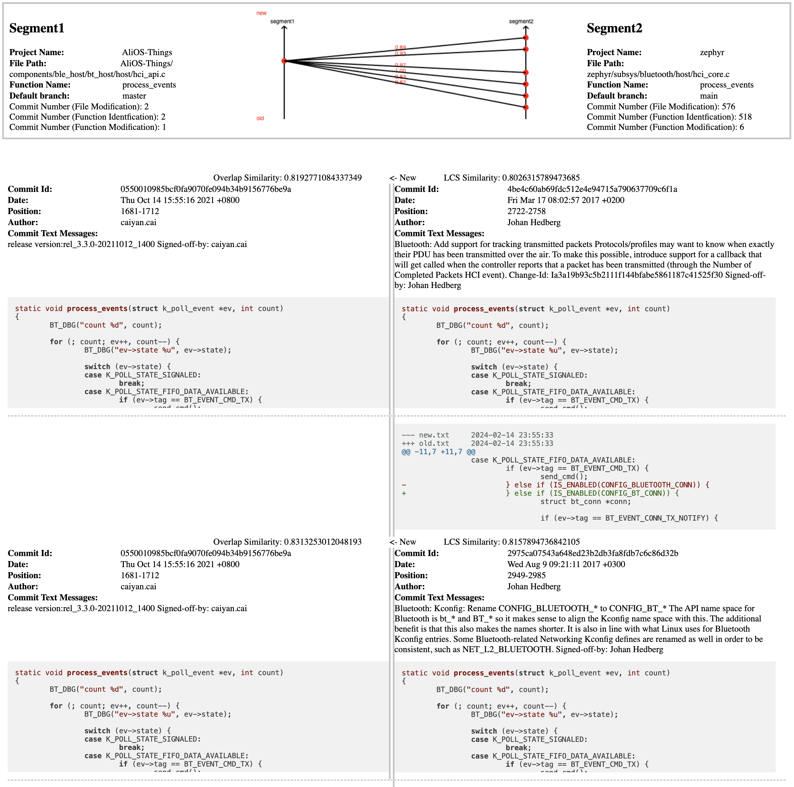

# MSCCD_CloneHistoryTracker

<!--  -->

## How to use

### Step 1: generate a similarity calculator of the target language

+ Config the generator by **./parserConfig.json**
  + parser: the path of the folder where ANTLR grammars of the target language are
  + grammarName
  + startSymbol

### Step 2: start tracking

+ We have two granularities
  + File level: controller_file.py
  + Function level: controller_func.py
+ Configurations in the controller_**.py
  + MSCCD_PATH: path to MSCCD
  + taskId, detectionId
  + cloneIndex: to configure which pair to track
    + x(x >= 0) : the clone index of target clone 
    + -1 : for all the clone
    + x(x < -1) : random sampling x pair from the taskId-detectionId
  + language
+ Dependencies: (Function mode only)
  + Java,Go: CTag
  + JavaScript, TypeScript: nodejs
  + C/C++: Clang
  
### Step 3: check results 

+ HTML report will be generated automatically in **./reports** folder
+ 
+ 

## denpencies in pip

+ jinja2
+ ujson 
+ matplotlib